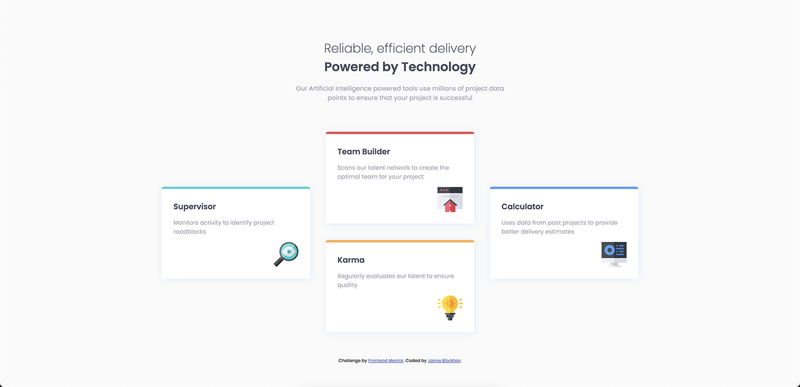

# Frontend Mentor - Four card feature section solution

This is a solution to the [Four card feature section challenge on Frontend Mentor](https://www.frontendmentor.io/challenges/four-card-feature-section-weK1eFYK). Frontend Mentor challenges help you improve your coding skills by building realistic projects. 

## Table of contents

- [Overview](#overview)
  - [The challenge](#the-challenge)
  - [Screenshot](#screenshot)
  - [Links](#links)
- [My process](#my-process)
  - [Built with](#built-with)
  - [What I learned](#what-i-learned)
  - [Continued development](#continued-development)
  - [Useful resources](#useful-resources)
- [Author](#author)
- [Acknowledgments](#acknowledgments)

**Note: Delete this note and update the table of contents based on what sections you keep.**

## Overview

### The challenge

Users should be able to:

- View the optimal layout for the site depending on their device's screen size

### Screenshot

### Links

- Solution URL: (https://github.com/digigrrl525/FM-four-card-feature)
- Live Site URL: (https://digigrrl525.github.io/FM-four-card-feature/)

## My process

I started with the desktop breakpoint. Then I moved on to mobile. In hindsight, it might have been faster to do the reverse.

### Built with

- Semantic HTML5 markup
- CSS custom properties

### What I learned

This was a good refresher on media queries. 

## Author

- Frontend Mentor - [@digigrrl525](https://www.frontendmentor.io/profile/digigrrl525)

